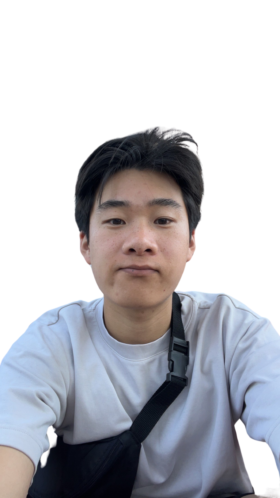

# Albert Ho's User Page
UCSD CSE 110 Software Developement, Spring 2025

## More about me
I am a **third year Computer Science undergrad** who is working towards a Master's in machine learning and it's applications in bioinformatics and biology.
I am in Warren College at UCSD, as a transfer student, and am very happy to be here. I hope to learn more about the Computer Sciences, and the steps and cycle
of software development. I hope to gain more knowledge about the different development approaches to which I can apply to my knowledge as a programmer and 
a Computer Scientist. 

## My interests
- Machine Learning
  - Developing
  - Predictions
- Bioinformatics
  - Statistical Analysis
  - Learning more about interdisciplinary Computer Science
- Game development
- Playing Music
  - Guitar (learning)
  - Piano
  
# Favorite Hobbies
1. Listening/Playing Music
2. Watching YouTube
3. Creating interesting applications for all kinds of problems

## Goals
- [ ] Work towards Masters
- [ ] Graduate
- [ ] Learn more about Computer Science and it's interdisciplinary aspects
- [ ] Solve the problems of the future
- [ ] Make my own music
- [ ] Learn how to play the guitar
- [ ] Become a pro/teach @ Computer Science
- [x] Create webpages/applications

## Find me
- [Linkedin](https://linkedin.com/in/albertho)
- [Portfolio](https://albertho.pages.dev)
- [GitHub](https://github.com/Tofulati)
  
Read more about the page on the [README](README.md)

[Jump to the top](#albert-hos-user-page) 

> This site was built using [GitHub Pages](https://pages.github.com/).
